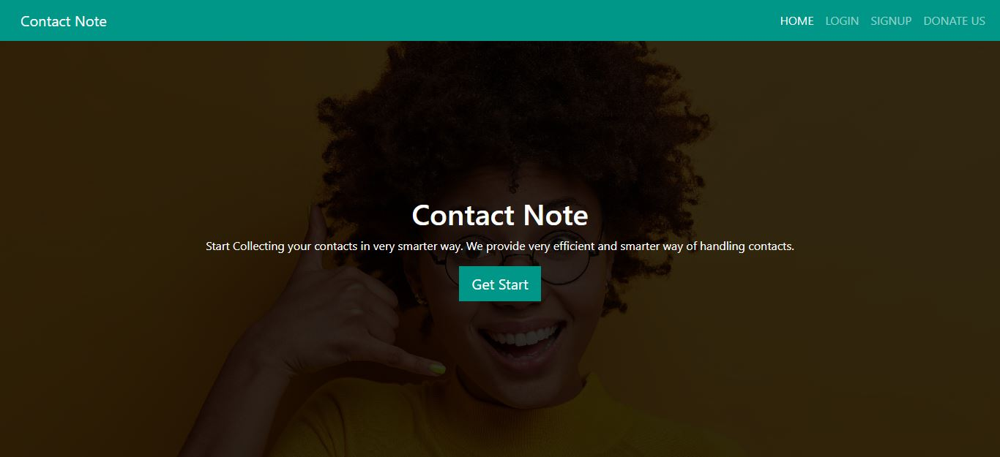
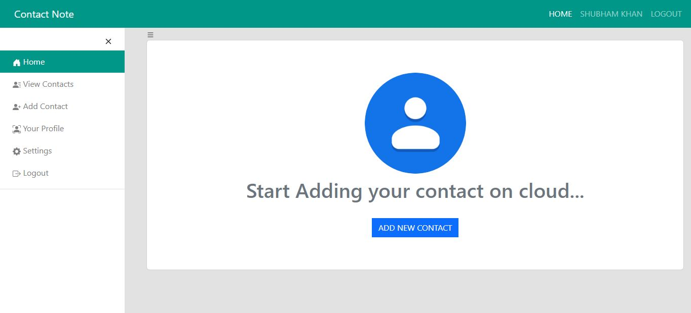
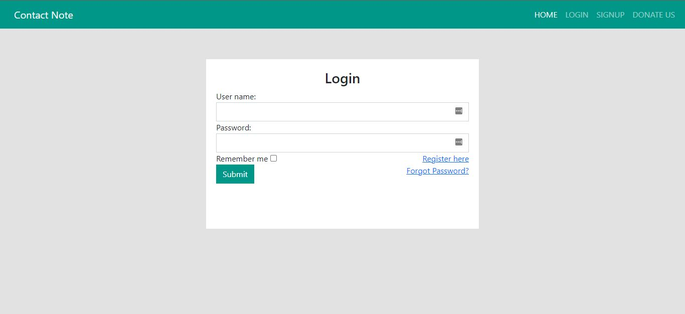
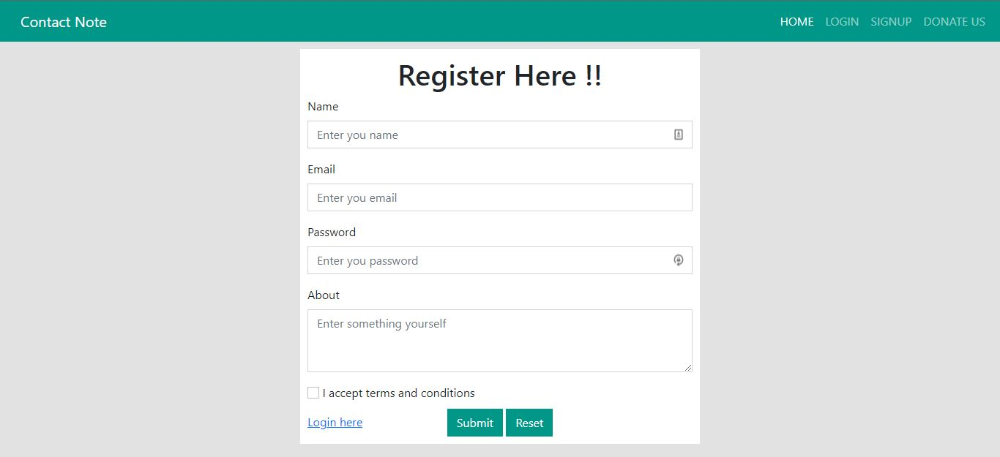
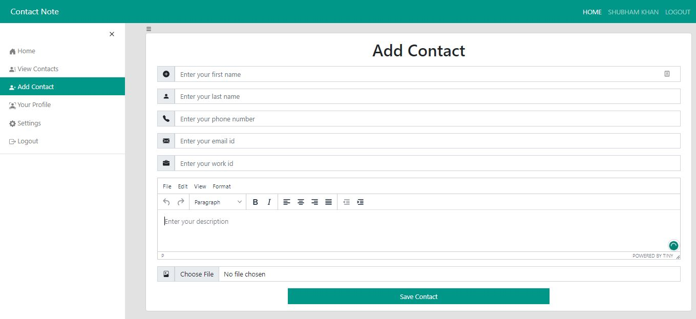
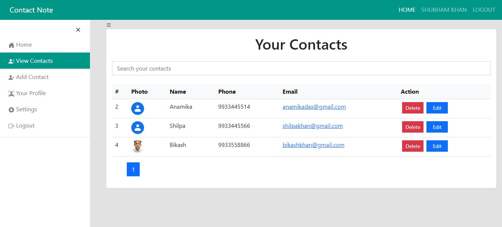
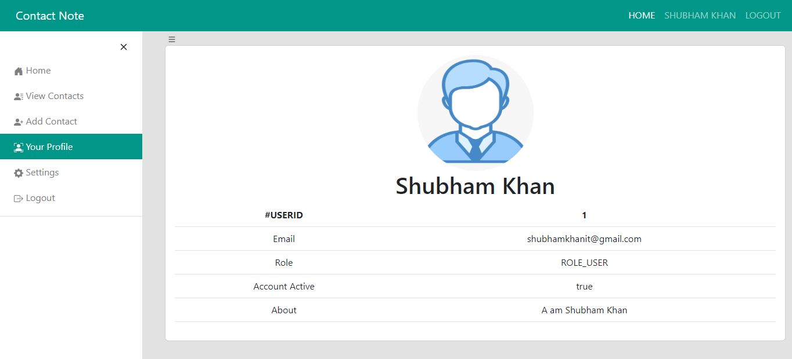
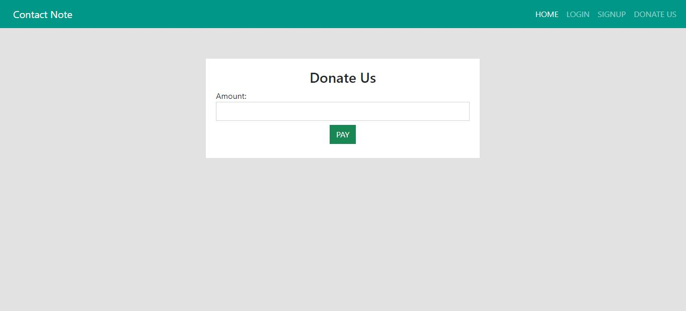

# Contact Note

A simple Spring boot Based mini project for storing contact in the database.

**Live Preview**: 

## Technology used

* HTML
* CSS
* Thymeleaf
* Spring boot
* PostgreSQL

## Introduction

Created a Contact Note system for storing multiple contact in the database. Developed Gmail integration for resetting passwords, and Razorpay payment gateway used for donate page

## Run Locally

To run this web app locally, simply follow these steps:

- Clone this repository with the following command :-

```
git clone https://github.com/shubhamkhan/Contact-Note.git
```

- Run maven project update in STS to install all the dependencies:-

```
mvn clean install -U
```

- Run Spring boot project in STS to start the app on port 8080:-

```
Run the file ContactNoteApplication.java
```

**Note** :- You need to have JAVA JDK installed on your local machine to run this app locally.

# Screenshot
[1] Home Page
---

---
[2] Dashboard
---

---
[3] Login
---

---
[4] SignUp
---

---
[5] Add Contact
---

---
[6] View Contacts
---

---
[7] Profile
---

---
[8] Donate Us
---

---

# License

[MIT License](https://github.com/shubhamkhan/Contact-Note/blob/main/LICENSE) @ [Shubham Khan](https://github.com/shubhamkhan/)
